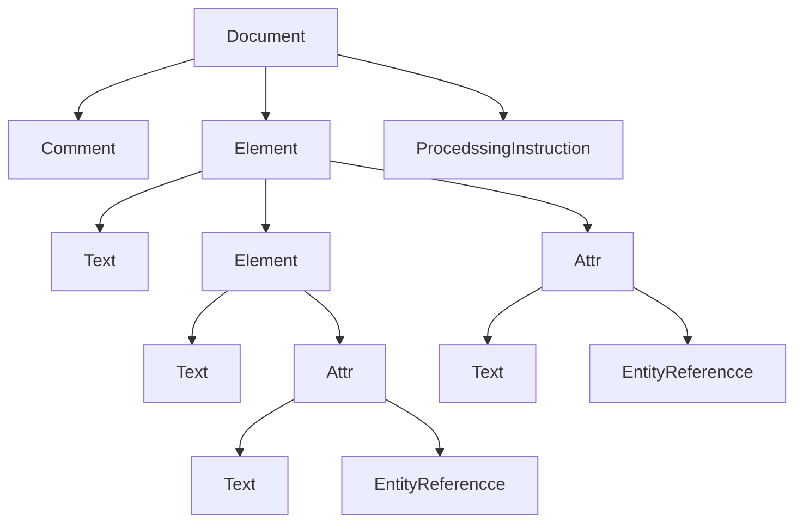
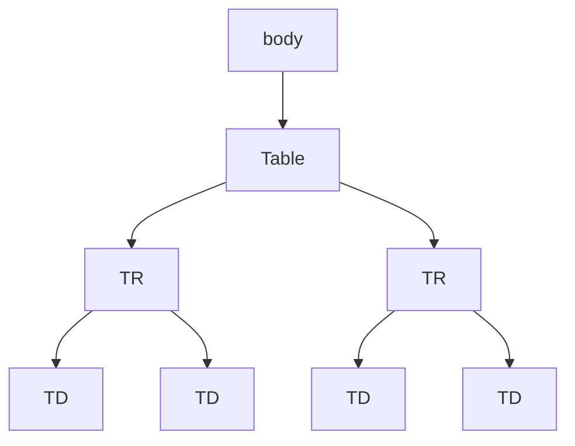

# 第02章 使用文档对象模型操作XML文档

文档对象模型（Document Object Model, DOM）是一种用于处理XML文档的API函数集。本章将学习以下内容：

- System.Xml命名空间中与DOM相关的类
- 使用DOM读写XML文档
- 使用DOM读写XML文档

## 2.1 文档对象模型概述

按照W3C的定义，DOM是“一种允许程序或脚本动态地访问更新文档内容，结构和样式的，独立于平台和语言的规范化接口”。DOM是标识文档和访问、操作构成文档的各种元素的应用程序接口，它以树状结构表示HTML和XML文档，定义了遍历这个树和检查、修改树的节点的方法和属性。在DOM中，我们将代表XML文件的程序设计称为节点，当处理被链接的XML文件并存储与DOM中时，他会为XML文件的每个基本组件建立一个节点。这些基本组件包括元素、属性与处理指令，DOM会使用不同形态的节点来代表不同形态的XML组件。

DOM会将XML文件的节点构成树状的阶层结构，反映出XML文件本身的阶层结构。DOM将会奖励一个单一文件节点来表示整个XML文件，并将其视为阶层结构的根节点。注意：XML元素的逻辑阶层结构包含整个XML方法，结构中的跟几点只是DOM节点的阶层结构的一个分支。

每个节点，就像可程序化对象，提供了属性和方法，让你可以存取、显示、管理以及取得对应到XML组件上的信息。

所有形态的节点共同分线各一组公共的属性与方法。这些属性与方法一般时设计来和节点一起运作的。DOM树结构的内容如图所示：



例如，我们有如下一个见到那的XML文档。

```xml
<body>
    <table>
        <tr>
            <td>Mahesh</td>
            <td>Testing</td>
        </tr>
        <tr>
            <td>Second Line</td>
            <td>Tested</td>
        </tr>
    </table>
</body>
```

表示这个的XML文档的DOM模型结构如图所示：



这些节点定义为接口的对象，可以使用这些接口来访问和操作文档对象。DOM的核心API还允许你常进啊和填充文件、加载文档并保存。

| 节点     | 描述                                             | 子节点                                      |
| -------- | ------------------------------------------------ | ------------------------------------------- |
| 文档     | 代表一个HTML或XML文档和文档树的根                | 元素、处理指令、文档类型、注释              |
| 文档类型 | 表示文档的文件类型属性                           | 无子节点                                    |
| 元素     | 一个文档元素                                     | 元素、文本、注释、处理指定、CDATA、实体引用 |
| 属性     | 一个属性                                         | 文本、实体引用                              |
| 处理指令 | 代表在XML中使用的一个处理指定                    | 无子节点                                    |
| 注释     | 在XML或HTML文件中位于开始`<!--`和`-->`之间的字符 | 无子节点                                    |
| 文本     | 节点的文本                                       | 无子节点                                    |
| 实体     | 实体类型的项目                                   | 元素、文本、注释、处理指令、CDATA、实体引用 |

## 2.2 DOM实现

微软的.NET框架在System.xml命名空间提供了系一列的类用于Dom的实现，XmlDocument时.NET中Domain实现的核心类之一。

XmlDocument将XML文件视为树状结构，它装载XML文档并在内存中欧股在该文档的树状结构。XmlDocument类代表了一个XML文档，它支持对于整个XML文档树的遍历、插入、删除和替换功能，该类包括了许多有用的函数。假设我们有一个如下所示的XML文档。

```xml
<?xml version="1.0" enconding="utf-8"?>
<Employees>
    <Employee ID="E0001">
        <Name>Li Shi</Name>
        <Phone>12345</Phone>
        <comments>Hired since 1990</comments>
    </Employee>
    <Employee ID="E0002">
        <Name>Zhang San</Name>
        <Phone>78901</Phone>
        <comments>Hired since 1993</comments>
    </Employee>
</Employees>
```

| 成分名                | 描述             |
| --------------------- | ---------------- |
| `<?xml ...?>`         | 处理指令         |
| Employees             | 文档元素或根节点 |
| Employee              | 元素             |
| ID                    | 属性             |
| Name、Phone、Comments | 子元素           |

此外，元素`<Name>、<Phone>、<Comments>`包含文本值，因而称为文本节点，当该文档装载于内存中时，即作为一个树状结构而存在。

在.NET框架中，通过一个抽象类XmlNode来表示一个节点，甚至文字值和属性都可以看作一个节点，仅仅是处理的方式略有不同而已。

| XML文档组成部分                 | 对应的类                 |
| ------------------------------- | ------------------------ |
| Document Element(文档元素)      | XmlElement               |
| Processing Instuction(处理指令) | XmlProcessingInstruction |
| Element(元素)                   | XmlElement               |
| Attribute（属性）               | XmlAttribute             |
| Text value                      | XmlText                  |
| Nodes(节点)                     | XmlNode                  |

> 上表中所设计的所有类都直接或间接继承了抽象类XmlNode

## 2.3 应用实例

在本小节中，我们将提供一系列的示例来展示DOM的各项功能。有限定义一个简单的XML文档Customers.xml。该文档如下：

```xml
<?xml version="1.0" encoding="utf-8" ?>
<customers>
  <customer customerid="1">
    <firstname>John</firstname>
    <lastname>Cranston</lastname>
    <homephone>(445) 269-9857</homephone>
    <notes>
      <![CDATA[He registed as our member since 1990. John has nice credity. He is a member of Custom International.]]>
  </notes>
  </customer>
  <customer customerid="2">
    <firstname>Annie</firstname>
    <lastname>Loskar</lastname>
    <homephone>(445) 269-9482</homephone>
    <notes>
      <![CDATA[Annie registed as our member since 1984. He became our VIP customer in 1996.]]>
    </notes>
  </customer>
  <customer customerid="3">
    <firstname>Bernie</firstname>
    <lastname>Christo</lastname>
    <homephone>(445) 269-3412</homephone>
    <notes>
      <![CDATA[Bernie registed as our member since June 2010. He is a new member.]]>
    </notes>
  </customer>
<customer customerid="4">
    <firstname>Ernestine</firstname>
    <lastname>Borrison</lastname>
    <homephone>(445) 269-7742</homephone>
    <notes>
      <![CDATA[Ernestine registed as our member since Junl 2010. She is a new member.]]>
    </notes>
  </customer>
</customers>
```

### 2.3.1 装载XML文档

XmlDocument类允许你通过三种方式打开一个XML文档：

- 指定XML文件路径或URL

  ```c#
  XmlDocument doc1 = new XmlDocument();
  doc1.Load("Customers.xml");
  ```
  
- 包含XML文档数据的文件流对象

  ```c#
  XmlDocument doc2 = new XmlDocument();
  using(FileStream stream = new FileStream("Customers.xml", FileMode.Open))
  	doc2.Load(stream);
  ```
  
- 包含XML文档数据的字符串

  ```c#
  const string strXml = "<?xml version=\"1.0\" encoding=\"utf-8\"?>" +
                        "<customers count=\"4\">" +
  					  "		<customer customerid=\"1\">" + 
  					  "			<firstname>John</firstname>" +
  					  "			<lastname>Cranston</lastname>" +
  					  "			<homephone>(445) 269-9857</homephone>" +
  					  "			<notes>" +
  					  "				<![CDATA[He registed as our member since 1990. John has nice credity. He is a member of Custom International.]]>" +
  					  "			</notes>" +
  					  "		</customer>" +
  					  "		<customer customerid=\"2\">" +
  					  "			<firstname>Annie</firstname>" +
  					  "			<lastname>Loskar</lastname>" +
  					  "			<homephone>(445) 269-9482</homephone>" +
  					  "			<notes>" +
  					  "				<![CDATA[Annie registed as our member since 1984. He became our VIP customer in 1996.]]>" +
  					  "			</notes>" +
  					  "		</customer>" +
  					  "		<customer customerid=\"3\">" +
  					  "			<firstname>Bernie</firstname>" +
  					  "			<lastname>Christo</lastname>" +
  					  "			<homephone>(445) 269-3412</homephone>" +
  					  "			<notes>" +
  					  "				<![CDATA[Bernie registed as our member since June 2010. He is a new member.]]>" +
  					  "			</notes>" +
  					  "		</customer>" +
  					  "		<customer customerid=\"4\">" +
  					  "			<firstname>Ernestine</firstname>" +
  					  "			<lastname>Borrison</lastname>" +
  					  "			<homephone>(445) 269-7742</homephone>" +
  					  "			<notes>" +
  					  "				<![CDATA[Ernestine registed as our member since Junl 2010. She is a new member.]]>" +
  					  "			</notes>" +
  					  "		</customer>" +
  					  "</customers>";
  XmlDocument doc3 = new XmlDocument();
  doc3.LoadXml(strXml);
  ```

  ### 2.3.2 遍历XML文档
  
  一个XML文档可以包含一个或多个节点，而每一个节点又可以包含一个或多个子节点。XmlNode类具有一个叫ChildNames的集合体，该集合体包含某种条件写的某节点的所有子节点列表。.NET框架中与DOM相关联的其他许多类都直接或间接地继承自XmlNode类。因而，在这些类中均可调用ChildNodes集合体。XmlNodes类定义了丰富的属性。如ParentNode，FirstChild, LastChild, HasChildNodes, NextSibling, PreviousSibling, Attributes, BaseURL, InnerXml, InnerText, NodeType, Name, Value。其中，ParaentNode属性允许访问当前节点的父节点，NextSibling属性允许访问与当前节点处于相同层次的另一个节点。InnerXml包含标记，InnerText不包含标记。

```c#
XmlDocument _doc = new XmlDocument();
_doc.Load("Customers.xml");

// 显示根节点
Console.WriteLine(_doc.DocumentElement.Name);
foreach (XmlNode node in _doc.DocumentElement.ChildNodes)
{
	Console.WriteLine("\tCustomer ID : {0}", node.Attributes["customerid"].Value);
	if (node.HasChildNodes)
	{
		foreach (XmlNode childnode in node.ChildNodes)
			Console.WriteLine("\t\t{0}:{1}", childnode.Name, childnode.InnerText);
	}
}
```

> customers
>  Customer ID : 1
>   firstname:John
>   lastname:Cranston
>   homephone:(445) 269-9857
>   notes:He registed as our member since 1990. John has nice credity. He is a member of Custom International.
>  Customer ID : 2
>   firstname:Annie
>   lastname:Loskar
>   homephone:(445) 269-9482
>   notes:Annie registed as our member since 1984. He became our VIP customer in 1996.
>  Customer ID : 3
>   firstname:Bernie
>   lastname:Christo
>   homephone:(445) 269-3412
>   notes:Bernie registed as our member since June 2010. He is a new member.
>  Customer ID : 4
>   firstname:Ernestine
>   lastname:Borrison
>   homephone:(445) 269-7742
>   notes:Ernestine registed as our member since Junl 2010. She is a new member.

### 2.3.3 查询特殊元素和节点

- GetElementByTagName()

  ```c#
  XmlDocument _doc = new XmlDocument();
  _doc.Load("Customers.xml");
  
  XmlNodeList list = _doc.GetElementsByTagName("firstname");
  
  foreach (XmlNode node in list)
  {
  	Console.WriteLine(node.InnerXml);
  }
  ```

  > John
  > Annie
  > Bernie
  > Ernestine

- GetElementById()

  如果在XMML文档中存在着一个具有唯一值的属性，比如Customers.xml中的customerid属性。在查询特殊元素或节点时，可使用该方法加以实现。其实现方式类似于应用主键在数据库中查询相应的记录。但问题在于XmlDocument类不能自动地指定元素的某个特殊的属性作为元素的“主键”，因此在应用此方法之前，必须在XML文档中通过DTD或Schema技术指定元素的某个属性作为元素的唯一的“主键”，同时使用XmlDocument类能够将该属性视为该元素的“主键”。以下时增加了DTD的XML文档。

  ```xml
  <?xml version="1.0" encoding="utf-8" standalone="yes" ?>
  <!DOCTYPE customers[
    <!ELEMENT customers ANY>
    <!ELEMENT customer ANY>
    <!ELEMENT firstname ANY>
    <!ELEMENT lastname ANY>
    <!ELEMENT homephone ANY>
    <!ELEMENT notes ANY>
    <!ATTLIST customer customerid ID #REQUIRED>
  ]>
  <customers>
    <customer customerid="1">
      <firstname>John</firstname>
      <lastname>Cranston</lastname>
      <homephone>(445) 269-9857</homephone>
      <notes>
        <![CDATA[He registed as our member since 1990. John has nice credity. He is a member of Custom International.]]>
    </notes>
    </customer>
    <customer customerid="2">
      <firstname>Annie</firstname>
      <lastname>Loskar</lastname>
      <homephone>(445) 269-9482</homephone>
      <notes>
        <![CDATA[Annie registed as our member since 1984. He became our VIP customer in 1996.]]>
      </notes>
    </customer>
    <customer customerid="3">
      <firstname>Bernie</firstname>
      <lastname>Christo</lastname>
      <homephone>(445) 269-3412</homephone>
      <notes>
        <![CDATA[Bernie registed as our member since June 2010. He is a new member.]]>
      </notes>
    </customer>
  <customer customerid="4">
      <firstname>Ernestine</firstname>
      <lastname>Borrison</lastname>
      <homephone>(445) 269-7742</homephone>
      <notes>
        <![CDATA[Ernestine registed as our member since Junl 2010. She is a new member.]]>
      </notes>
    </customer>
  </customers>
  ```

  ```c#
  XmlDocument doc = new XmlDocument();
  doc.Load("Customers.xml");
  
  XmlElement _xel = doc.GetElementById("1");
  Console.WriteLine(_xel.ChildNodes[0].InnerText);
  Console.WriteLine(_xel.ChildNodes[1].InnerText);
  Console.WriteLine(_xel.ChildNodes[2].InnerText);
  Console.WriteLine(_xel.ChildNodes[3].InnerText);
  ```

  > John
  > Cranston
  > (445) 269-9857
  > He registed as our member since 1990. John has nice credity. He is a member of Custom International.

- SelectNodes()

  查询符合条件的所有节点。

  ```c#
  XmlDocument _doc = new XmlDocument();
  _doc.Load("Customers.xml");
  
  XmlNodeList list = _doc.SelectNodes(string.Format("//customer[./firstname/text()='{0}']", "John"));
  
  foreach (XmlNode node in list)
  {
  	Console.WriteLine(node.ChildNodes[0].InnerText);
  	Console.WriteLine(node.ChildNodes[1].InnerText);
  	Console.WriteLine(node.ChildNodes[2].InnerText);
  	Console.WriteLine(node.ChildNodes[3].InnerText);
  }
  ```

  > John
  > Cranston
  > (445) 269-9857
  > He registed as our member since 1990. John has nice credity. He is a member of Custom International.

- SelectSingleNode()

  返回满足条件的第一个节点

  ```c#
  XmlDocument _doc = new XmlDocument();
  _doc.Load("Customers.xml");
  
  XmlNode node = _doc.SelectSingleNode(string.Format("//customer[./firstname/text()='{0}']", "John"));
  if(node != null)
  {
  	Console.WriteLine(node.ChildNodes[0].InnerText);
  	Console.WriteLine(node.ChildNodes[1].InnerText);
  	Console.WriteLine(node.ChildNodes[2].InnerText);
  	Console.WriteLine(node.ChildNodes[3].InnerText);
  }
  ```

  > John
  > Cranston
  > (445) 269-9857
  > He registed as our member since 1990. John has nice credity. He is a member of Custom International.

## 2.4 修改XML文档

### 2.4.1 Save

该方法保存文档到指定的位置。传入的参数为XmlWrite、XmlTextWriter或字符串。

```c#
XmlDocument _doc = new XmlDocument();
_doc.Load("D:\\Customers.xml");

// Method 1
using(XmlTextWriter writer = new XmlTextWriter("D:\\Customers2.xml", Encoding.UTF8))
{
	writer.Formatting = Formatting.Indented;
	_doc.Save(writer);
}

// Method 2
_doc.Save("D:\\Customers3.xml");

// Method 3
_doc.Save(Console.Out);
```

# 2.4.2 XmlDocumentFragment类

通常情况下，当你需要在一个XML文档中插入部分内容或节点时，将要用到这个类。这个类派生子XmlNode，它具有相同的树节点遍历，插入，删除和替换功能。通常通过调用XML文档的CreateDocumentFragment()方法来创建这个类的实例。该实例的InnerText属性代表当前节点的子节点。

```c#
string strXml = "<?xml version=\"1.0\" encoding=\"utf-8\"?>"
               +"<bookstore>"
			   +"	<book>"
			   +"		<name> The Autobiography of Benjamin Franklin</name>"
			   +"			<author>"
			   +"				<first-name>Benjamin</first-name>"
			   +"				<last-name>Franklin</last-name>"
			   +"			</author>"
			   +"		<price>8.99</price>"
			   +"	</book>"
			   + "</bookstore>";
string strFra = "<book>"
			   +"	<name> The Cofidence Man</name>"
			   +"		<author>"
			   +"			<first-name>Herman</first-name>"
			   +"			<last-name>Melville</last-name>"
			   +"		</author>"
			   +"	<price>11.99</price>"
			   +"</book>";
XmlDocument xmlDoc = new XmlDocument();
xmlDoc.LoadXml(strXml);

XmlDocumentFragment docFrag = xmlDoc.CreateDocumentFragment();
docFrag.InnerXml = strFra;

XmlNode root = xmlDoc.DocumentElement;
root.AppendChild(docFrag);

// 以便格式化显示
xmlDoc.LoadXml(xmlDoc.InnerXml);

xmlDoc.Save(Console.Out);
```

> <?xml version="1.0" encoding="utf-16"?>
> <bookstore>
>   <book>
>     <name> The Autobiography of Benjamin Franklin</name>
>     <author>
>       <first-name>Benjamin</first-name>
>       <last-name>Franklin</last-name>
>     </author>
>     <price>8.99</price>
>   </book>
>   <book>
>     <name> The Cofidence Man</name>
>     <author>
>       <first-name>Herman</first-name>
>       <last-name>Melville</last-name>
>     </author>
>     <price>11.99</price>
>   </book>
> </bookstore>

### 2.4.3 XmlElement类

XmlElement类的对象代表一个文档中出现的元素。这个类来自XmlLinkedNode类，XmlLinkedNode继承自XmlNode.

XmlLinkedNode类有两个有用的属性：NextSibing和PrevoiusSibling。XmlElement类实现添加和删除属性和元素的一些有用方法。

| 方法                                   | 描述                       |
| -------------------------------------- | -------------------------- |
| GetAttribute                           | 返回属性值                 |
| HasAttribute                           | 检查节点是否包含指定属性   |
| RemoveAll                              | 删除当前节点的所有子节点   |
| RremoveAllAtrributes、RremoveAtrribute | 删除节点的属性             |
| RremoveAtrributeAt                     | 移除指定索引的属性         |
| RremoveAtrributeNode                   | 从元素中删除指定的属性节点 |
| SetAttribute                           | 设置属性                   |
| SetAttributeNode                       | 添加新的属性节点           |

### 2.4.4 添加节点到XML文档中

```c#
XmlDocument xmlDoc = new XmlDocument();
xmlDoc.LoadXml("<Records></Records>");

XmlNode comment = xmlDoc.CreateComment("DOM Testing Sample");
xmlDoc.InsertBefore(comment, xmlDoc.DocumentElement);

XmlNode node = xmlDoc.CreateElement("FirstName");
node.InnerText = "Mahesh";
xmlDoc.DocumentElement.AppendChild(node);

xmlDoc.Save(Console.Out);
```

> <?xml version="1.0" encoding="utf-16"?>
> <!--DOM Testing Sample-->
> <Records>
>  <FirstName>Mahesh</FirstName>
> </Records>


### 2.4.5 删除和更换节点

- 移除所有

```c#
string strXml = "<?xml version=\"1.0\" encoding=\"utf-8\"?>"
			   + "<bookstore>"
			   + "	<book>"
			   + "		<name> The Autobiography of Benjamin Franklin</name>"
			   + "			<author>"
			   + "				<first-name>Benjamin</first-name>"
			   + "				<last-name>Franklin</last-name>"
			   + "			</author>"
			   + "		<price>8.99</price>"
			   + "	</book>"
			   + "	<book>"
			   + "		<name> The Cofidence Man</name>"
			   + "			<author>"
			   + "				<first-name>Herman</first-name>"
			   + "				<last-name>Melville</last-name>"
			   + "			</author>"
			   + "		<price>11.99</price>"
			   + "	</book>"
			   + "</bookstore>";
XmlDocument xmlDoc = new XmlDocument();
xmlDoc.LoadXml(strXml);

xmlDoc.DocumentElement.RemoveAll();

xmlDoc.Save(Console.Out);
```

> <?xml version="1.0" encoding="utf-16"?>
> <bookstore>
> </bookstore>

- 移除指定

```c#
string strXml = "<?xml version=\"1.0\" encoding=\"utf-8\"?>"
			   + "<bookstore>"
			   + "	<book>"
			   + "		<name> The Autobiography of Benjamin Franklin</name>"
			   + "			<author>"
			   + "				<first-name>Benjamin</first-name>"
			   + "				<last-name>Franklin</last-name>"
			   + "			</author>"
			   + "		<price>8.99</price>"
			   + "	</book>"
			   + "	<book>"
			   + "		<name> The Cofidence Man</name>"
			   + "			<author>"
			   + "				<first-name>Herman</first-name>"
			   + "				<last-name>Melville</last-name>"
			   + "			</author>"
			   + "		<price>11.99</price>"
			   + "	</book>"
			   + "</bookstore>";
XmlDocument xmlDoc = new XmlDocument();
xmlDoc.LoadXml(strXml);


xmlDoc.DocumentElement.RemoveChild(xmlDoc.DocumentElement.ChildNodes[0]);

xmlDoc.Save(Console.Out);
```

> <?xml version="1.0" encoding="utf-16"?>
> <bookstore>
>  <book>
>   <name> The Cofidence Man</name>
>   <author>
>    <first-name>Herman</first-name>
>    <last-name>Melville</last-name>
>   </author>
>   <price>11.99</price>
>  </book>
> </bookstore>

- 替换节点

```c#
string strXml = "<?xml version=\"1.0\" encoding=\"utf-8\"?>"
			   + "<bookstore>"
			   + "	<book>"
			   + "		<name> The Autobiography of Benjamin Franklin</name>"
			   + "			<author>"
			   + "				<first-name>Benjamin</first-name>"
			   + "				<last-name>Franklin</last-name>"
			   + "			</author>"
			   + "		<price>8.99</price>"
			   + "	</book>"
			   + "	<book>"
			   + "		<name> The Cofidence Man</name>"
			   + "			<author>"
			   + "				<first-name>Herman</first-name>"
			   + "				<last-name>Melville</last-name>"
			   + "			</author>"
			   + "		<price>11.99</price>"
			   + "	</book>"
			   + "</bookstore>";
XmlDocument xmlDoc = new XmlDocument();
xmlDoc.LoadXml(strXml);


xmlDoc.DocumentElement.ReplaceChild(xmlDoc.DocumentElement.ChildNodes[1],xmlDoc.DocumentElement.ChildNodes[0]);

xmlDoc.Save(Console.Out);
```

> <?xml version="1.0" encoding="utf-16"?>
> <bookstore>
>  <book>
>   <name> The Cofidence Man</name>
>   <author>
>    <first-name>Herman</first-name>
>    <last-name>Melville</last-name>
>   </author>
>   <price>11.99</price>
>  </book>
> </bookstore>

### 2.4.6 XML片段插入到XML文档

```c#
XmlDocument xmlDoc = new XmlDocument();
XmlNode comment = xmlDoc.CreateComment("DOM Testing Sample");
xmlDoc.AppendChild(comment);

XmlNode root = xmlDoc.CreateElement("Root");
xmlDoc.AppendChild(root);

XmlDocumentFragment frag = xmlDoc.CreateDocumentFragment();
frag.InnerText = "<Fragment>Fragment Test</Fragment>";
xmlDoc.DocumentElement.AppendChild(frag);

xmlDoc.Save(Console.Out);
```

### 2.4.7 添加属性到节点

```c#
string strXml = "<?xml version=\"1.0\" encoding=\"utf-8\"?>"
			   + "<bookstore>"
			   + "	<book> The Autobiography of Benjamin Franklin"
			   + "	</book>"
			   + "</bookstore>";
XmlDocument xmlDoc = new XmlDocument();
xmlDoc.LoadXml(strXml);

XmlAttribute newAttr = xmlDoc.CreateAttribute("NewAttribute");
((XmlElement)xmlDoc.DocumentElement.FirstChild).SetAttributeNode(newAttr);

xmlDoc.Save(Console.Out);
```

> <?xml version="1.0" encoding="utf-16"?>
> <bookstore>
>  <book NewAttribute=""> The Autobiography of Benjamin Franklin </book>
> </bookstore>

## 2.6 处理空白

在任何XML文档中都可能存在空白内容，如空格、制表符、回车换行等。默认情况下，当你加载或保存文件时，XmlDocument类将忽略空白，但这某些情况下，我们或许需要某些空白内容。可以通过一个PreserveWhiteSpace的布尔属性设置为true来保留空白。

```c#
string strXml = "<?xml version=\"1.0\" encoding=\"utf-8\"?>"
			   + "<bookstore>"
			   + "	<book> The     Autobiography of Benjamin Franklin"
			   + "	</book>"
			   + "</bookstore>";
XmlDocument xmlDoc = new XmlDocument();
xmlDoc.LoadXml(strXml);

xmlDoc.Save(Console.Out);
Console.WriteLine("\n00000000000000000000000000");
xmlDoc.PreserveWhitespace = true;
xmlDoc.Save(Console.Out);
```

> <?xml version="1.0" encoding="utf-16"?>
> <bookstore>
>  <book> The   Autobiography of Benjamin Franklin </book>
> </bookstore>
> 00000000000000000000000000
> <?xml version="1.0" encoding="utf-16"?><bookstore><book> The   Autobiography of Benjamin Franklin </book></bookstore>

## 2.7 处理命名空间

```c#
string strXml = "<cus:customers xmlns:cus=\"http://www.customerservice.com\">"
			   +"	<cus:customer customerid = \"1\" >"
			   +"		<cus:firstname > John </cus:firstname >"
			   +"		<cus:lastname > Cranston </cus:lastname >"
			   +"		<cus:homephone > (445) 269 - 9857 </cus:homephone >"
			   +"	</cus:customer >"
			   +"</cus:customers > ";
XmlDocument xmlDoc = new XmlDocument();
xmlDoc.LoadXml(strXml);

Console.WriteLine(xmlDoc.DocumentElement.NamespaceURI);
Console.WriteLine(xmlDoc.DocumentElement.Prefix);
Console.WriteLine(xmlDoc.DocumentElement.LocalName);
```


## 2.8 XmlDocument类的事件

当修改XML文档时，可能会激发XmlDocument类提供的事件过程。这些事件过程分别事前或事后的激发模式。事前模式是指在实际操作发生前即激发事件过程。事后模式是指在事件操作发生后才激发事件过程。

| 事件名        | 描述                                                 |
| ------------- | ---------------------------------------------------- |
| NodeChanging  | 当属于此文档的任何节点的值属性要被更改时，发生此事件 |
| NodeChanged   | 当属于此文档的任何节点的值属性被更改后，发生此事件   |
| NodeInserting | 当属于此文档的任何节点要被插入其他节点时，发生此事件 |
| NodeInserted  | 当属于此文档的任何节点被插入其他节点后，发生此事件   |
| NodeRemoving  | 当属于此文档的任何节点要被移除时，发生此事件         |
| NodeRemoved   | 当属于此文档的任何节点被移除后，发生此事件           |

```c#
string strXml =  "<bookstore>"
			   + "	<book> The Autobiography of Benjamin Franklin</book>"
			   + "</bookstore>";
XmlDocument xmlDoc = new XmlDocument();
xmlDoc.LoadXml(strXml);

xmlDoc.NodeChanging  += (s, e) => { Console.WriteLine("NodeChanging");};
xmlDoc.NodeChanged   += (s, e) => { Console.WriteLine("NodeChanged" );};
xmlDoc.NodeInserting += (s, e) => { Console.WriteLine("NodeInserting" );};
xmlDoc.NodeInserted  += (s, e) => { Console.WriteLine("NodeInserted"); };
xmlDoc.NodeRemoving  += (s, e) => { Console.WriteLine("NodeRemoving"); };
xmlDoc.NodeRemoved   += (s, e) => { Console.WriteLine("NodeRemoved"); };

Console.WriteLine("$$$$$$$$$$$$$$$$$$$ {0} $$$$$$$$$$$$$$$$$$$", "Modify");
xmlDoc.DocumentElement.FirstChild.InnerText = "new book";

Console.WriteLine("$$$$$$$$$$$$$$$$$$$ {0} $$$$$$$$$$$$$$$$$$$", "Insert");
XmlElement element = xmlDoc.CreateElement("Book");
xmlDoc.DocumentElement.InsertAfter(element, xmlDoc.DocumentElement.FirstChild);

Console.WriteLine("$$$$$$$$$$$$$$$$$$$ {0} $$$$$$$$$$$$$$$$$$$", "Remove");
xmlDoc.DocumentElement.RemoveChild(element);
```

> $$$$$$$$$$$$$$$$$$$ Modify $$$$$$$$$$$$$$$$$$$
> NodeChanging
> NodeChanged
> $$$$$$$$$$$$$$$$$$$ Insert $$$$$$$$$$$$$$$$$$$
> NodeInserting
> NodeInserte
> $$$$$$$$$$$$$$$$$$$ Remove $$$$$$$$$$$$$$$$$$$
> NodeRemoving
> NodeRemoved


